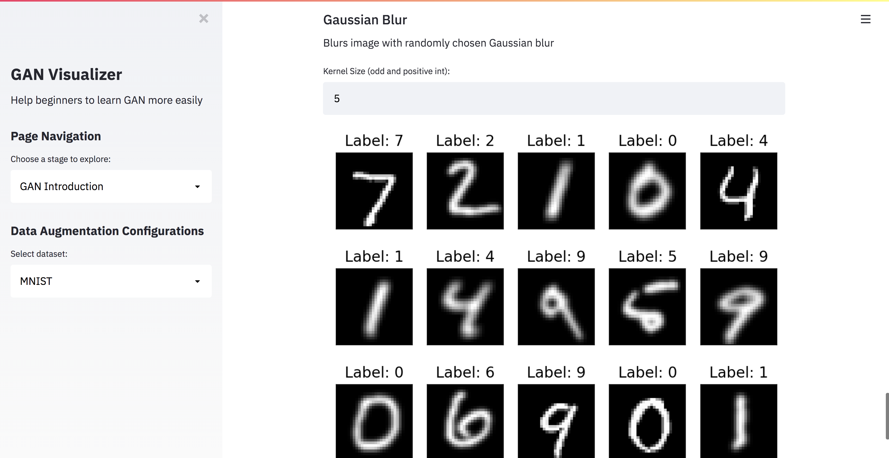
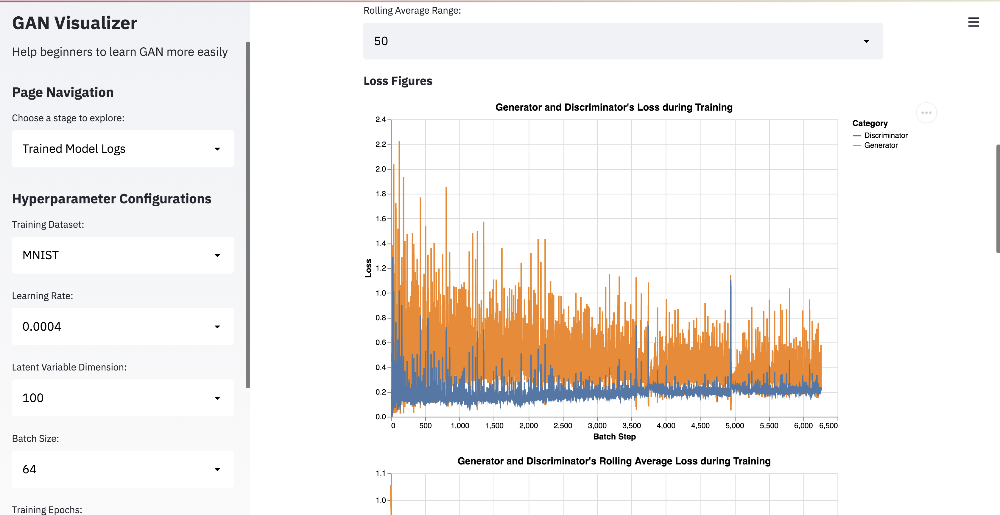
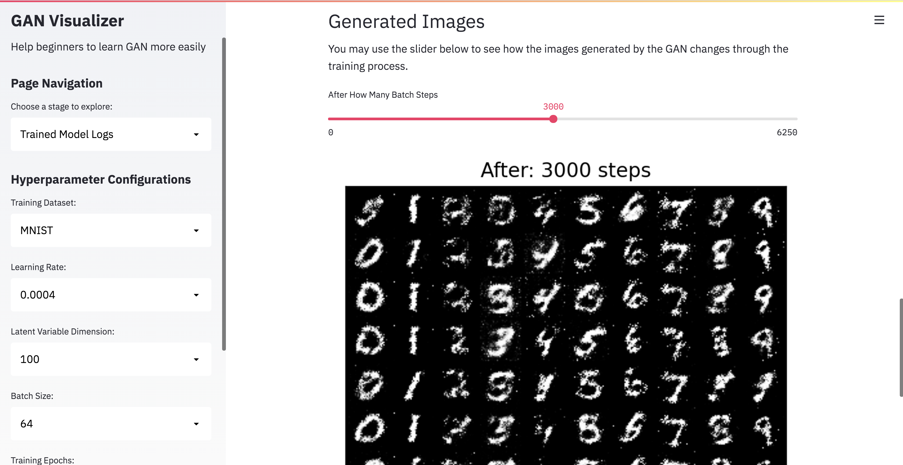
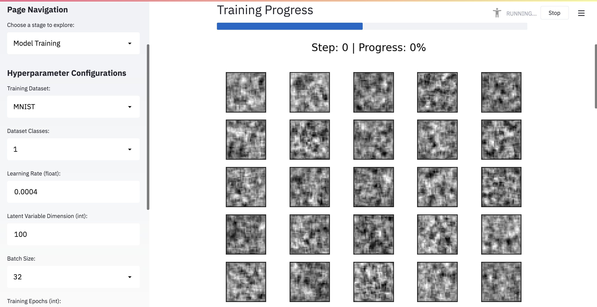
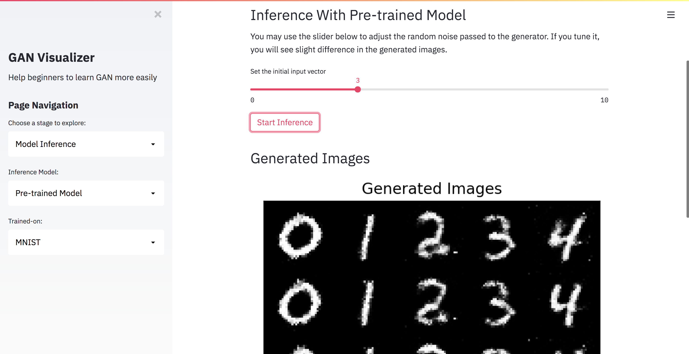

# CMU Interactive Data Science Final Project

- **Online URL**: https://share.streamlit.io/cmu-ids-2021/fp--zixuc-jiajunb/main/app.py
- **Report (MD) URL**:
  - [PDF](Report.pdf)
  - [MD](Report.md)
- **Video URL**: https://drive.google.com/file/d/1RkdWHehcav6G5lu3DW5gZ0H6_dzQDisN/view?usp=sharing
- **Team members**:
  - Contact person: zixuc@andrew.cmu.edu
  - jiajunb@andrew.cmu.edu
- **Track**: Application

## Summary Images

## Abstract

Recently, Generative adversarial network (GAN) has attracted more and more people’s attention and is applied widely in the real world. However, as an advanced neural network architecture, GAN is generally hard to understand, especially for people with little prior knowledge about machine learning and deep learning. In this project, we aim to build an interactive application that allows users to understand GAN easily by intuitive visualization.

## Running Instructions

Click on the online URL above and you should be able to run the application. You may use the sidebar to navigate between pages and do some configurations on the application. If you encounter a Streamlit error when running the application, it is most likely that multiple people are running the app to train models at the same time and the resource limit is reached. Please reach out to us in this case, and we will reboot the app.

## Work distribution

**Zixu Chen**: Zixu worked on the Streamlit interactive components. He mainly designed and implemented the first 4 pages. He integrated PyTorch data augmentation into Streamlit to display the data augmentation feature. He utilized Streamlit components, Altair, and Matplotlib to write the interactive components and visualizations. In the trained model logs and model training page, he integrated the stats, images, and training function from Jiajun to enable training the model with the interactive interface.

**Jiajun Bao**: Jiajun worked on pretraining all the 60 models and logging the loss stats and generated images. He also processed the MNIST and FashionMNIST datasets into a small one-class dataset to speed up training on Streamlit deployment. Lastly but most importantly, he wrote the PyTorch and Streamlit code for training the GAN model, using the model to do inference (generate new images), and the core parts of the model inference page.

## Deliverables

### Proposal

- [x] The URL at the top of this readme needs to point to your application online. It should also list the names of the team members.
- [x] A completed [proposal](Proposal.md). The contact should submit it as a PDF on Canvas.

### Design review

- [x] Develop a prototype of your project.
- [x] Create a 5 minute video to demonstrate your project and lists any question you have for the course staff. The contact should submit the video on Canvas.

### Final deliverables

- [x] All code for the project should be in the repo.
- [x] A 5 minute video demonstration.
- [x] Update Readme according to Canvas instructions.
- [x] A detailed [project report](Report.md). The contact should submit the video and report as a PDF on Canvas.
