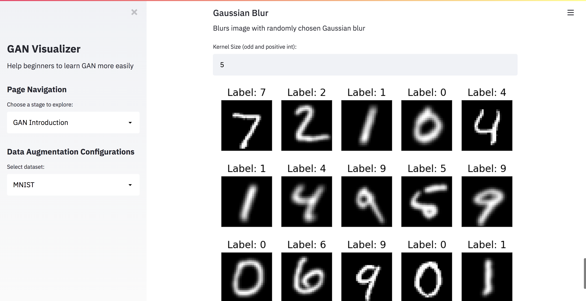
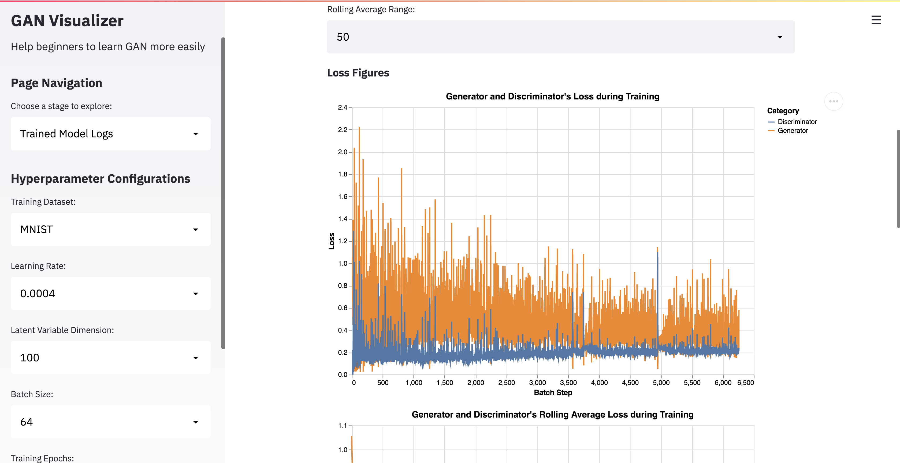
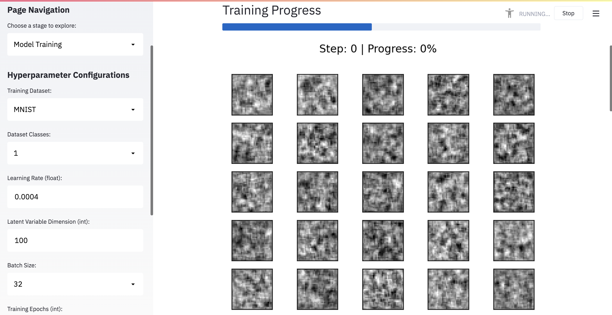

# Final Project Report

**Project URL**: https://share.streamlit.io/cmu-ids-2021/fp--zixuc-jiajunb/main/app.py

Group Members: Jiajun Bao, Zixu Chen

## Abstract

Recently, Generative adversarial network (GAN) has attracted more and more people’s attention and is applied widely in the real world. However, as an advanced neural network architecture, GAN is generally hard to understand, especially for people with little prior knowledge about machine learning and deep learning. In this project, we aim to build an interactive application that allows users to understand GAN easily by intuitive visualization.

## Introduction

GAN is a deep neural network architecture that can output new data that resembles input data. At a high level, GAN consists of a generator and a discriminator. The generator learns from the training set to generate outputs with similar distribution as the original data, while the discriminator tries to distinguish generated outputs from the authentic data. The two have to compete with each other in a zero-sum game fashion to avoid suffering loss.

Although GAN is complex for beginners, our project can give them an intuition of what GAN is and how GAN works. We use the interactive components and text explanation in Streamlit to let users easily train a GAN model and visualize how the generated images and loss curve change throughout the training process. After the user's training is completed, they can also use the model they just trained to generate new images based on different input noise and compare the images with those generated by pre-trained models.

## Related Works

As a popular neural network model, there are some related works on GAN visualization. The first is [GAN Lab](https://poloclub.github.io/ganlab/). It visualizes how the gradients change throughout the training epochs. However, this visualization is very abstract, so it is hard for people who are new to this field to have a clear idea of how the input is affecting the generated images. Usually, those who are new to this direction care more about how the final images change as they change the input rather than how the model parameters are changing. The second is a demo of [Face GAN](https://github.com/streamlit/demo-face-gan) created by Streamlit. This application closely mimics what we want to do. However, this application does not allow users to play with the training steps as the model is pre-trained, and the application is only limited to the face dataset. The third is [GAN Dissection](https://gandissect.csail.mit.edu/), whose co-authors include Professor Hendrik Strobelt. The application is very interesting in that it allows users to generate and fit a set of items on an existing image with a paint brush. However, this does not involve a lot about visualizing the training and inference of GAN, which is different from our purpose in this project.

## Methods

### Datasets

We use the MNIST and FasthionMNIST datasets in the application. MNIST is a 10-class dataset of handwritten digits from 0 to 9. FashionMNIST is also a 10-class dataset of fashion items like coats and bags. Both of them have a total of 60,000 training images and 10,000 testing images, each of which are 28×28 pixel grayscale images.

There are two main reasons for using these two datasets. The first reason is that the Streamlit deployment machine is relatively weak (1 CPU, 800 MB of RAM, and 800 MB of dedicated storage), and we have to use small and simple datasets so that the complex GAN model can run on the deployment machine and train reasonably fast to avoid long waiting time. More complex datasets like ImageNet and Human Faces require either very powerful machines or training for a very long time. The second reason is that most people are familiar with the two datasets. Even if they don’t know them before, it’s really easy to recognize and distinguish the items (number digits and fashion items) in the image, so it would be easier for users to evaluate the generated images. A negative example would be the KMNIST dataset. Even us who grew up in Asian cannot easily recognize the Kanji characters in the dataset.

### Model

We integrated two different types of generative adversarial networks in the playground: a vanilla GAN that directly learns the distribution of the input data, and a conditional GAN that learns multiple distributions grouped by image labels. Both models use deep convolutional layers as their encoders and decoders. The architecture is shown below.

## Results

Our Streamlit application is strongly focused in the interactive application track, so we will mainly show some of the interactive components and visualizations instead of analysis of data.

### Visualization Designs

#### Dataset Overview Page

We introduce the two datasets (MNIST and FashionMNIST) in our application. Since both of them are image datasets, the best way to present them would be just visualize the images within the datasets. For each dataset, we present the 10 class labels along with a corresponding image of that class as well as a sample of 25 random images drawn from the database stored on the machine. After looking at this page, the users will have an idea of what the datasets look like and what they will expect for the generated images.

#### GAN Intro Page

This page incorporates introductions to GAN from different perspectives, introduction to our application and the tunable hyperparameters, and a playground to apply data augmentation techniques. We introduce the high-level idea of GAN with an illustration of the architecture. We intentionally eliminate the low-level architecture details of our model so that the users will not be overwhelmed with the complexity of it. To introduce GAN in another dimension, we compare it with another common computer vision (CV) deep neural network model called Convolutional Neural Network (CNN) so that beginners can understand how the two CV models differ in use cases and the relationship between the two models. Lastly, since GAN is sometimes used as an advanced data augmentation technique to facilitate CNN tasks, we add an interactive module to allow users to play around with 4 common data augmentation techniques. The users can tune the data augmentation parameters to see different magnitudes of the augmentation effects and compare the augmented images with the original images. We hope users can get a mindset of what GAN is and its use cases after checking out this page.

#### Trained Model Logs Page

This page is presented to complement the potential long wait time to train a good GAN model with the full 10-class datasets. We pre-trained 60 models and recorded the training logs and generated images. The users can choose the datasets that the model was trained on, and adjust the learning rate and hidden weight size. Bath size and training epoch are fixed for all the models here. The users can see the logged training loss curves and generated images throughout one model’s training process. We provide three additional interactive features for the training loss curve.

The first is to define an upperbound to smooth the outliers. For some high learning rates, the loss will sometimes be suddenly tens of thousands times higher in some iterations, and it makes the scale of the image to mismatch most of the loss records. By restricting the upperbound to a smaller value, we can essentially get rid of the outliers and focus on the normal data points. The second is to define a rolling average range. The reason is that the GAN training loss curve is zig-zagging up and down with high magnitude. Showing the rolling average can help smooth the curves and observe the patterns more easily. The third is a sliding range selector at the rolling average figure. It allows the users to zoom in the original loss curve after observing the high-level trend to see the loss details.

We also have a slider to check how the generated images change throughout the training process. When the slider slides, the generated image corresponding to the batch step is shown. With proper setting of the parameters, users should observe the items in the images become clearer and clearer and more similar to the input images.

The above interactions and figures give the users a sense of roughly how the model will evolve over time and be ready to train their own models in the next page.

#### Training Page

The users have a large flexibility in this page to train their models. They can choose the source dataset (MNIST or FashionMNIST), the size of the data set (small one class dataset vs full ten class dataset), learning rate, hidden weight size, training epochs, and the sample interval (how often to collect stats and generated images). We provide an interactive progress bar to track the training progress and have an option to display the intermediate generated image during training. When training is done, the trained model is automatically saved, and the user will see the panel of loss curves and generated images similar to the one in the “Trained Model Logs” page.

The progress bar interaction lets the users know the training is progressing instead of worrying about the long wait time. Additionally, they can also utilize the loss curve figures and generated image logs to compare their models with the pre-trained model we provided.

#### Inference Page

This page allows users to generate new images with the model they trained or the model we pre-trained. We have an interactive slide bar for users to adjust the random noise vector, and it can be used to generate different images. The users can learn that different random noises can result in different images.

## Discussion

In this work, we designed a playground for Generative adversarial networks which includes the whole machine learning pipeline like data processing, model training and model inference.

### New insights and practices

We get a few interesting insights. The quality of a generative adversarial network depends mostly on the complexity of data distributions. For simple datasets like MNIST and FashionMNIST, small datasets are enough to train good networks with. In order to test out our application with regard to user experience, we invited our friends to try out our application. All of them have taken elementary machine learning classes but have no experience with GAN. They are asked to train at least one GAN model and observe the training curve through our application. We received 12 responses in total. Interestingly, over half of the respondents found our system easy to use. Specifically, frequently mentions findings includes: (1) a good learning rate to training GANs is in the range from 2 \* 10^(-4) to 2 \* 10^(-3). (2) The learning rate plays a large role in the quality of the resulting models than other hyperparameters like the dimension of hidden layers. Based on those observations, we believe our system is a good starting point for intro-level researchers who want to learn and use GANs.

## Future Works

We received many constructive feedbacks from our in-class presentations and the survey, which can mainly be categorized into two classes. First, 30% of respondents recommended us to include the visualization of image representation from hidden layers, since those visualizations will help explore the detailed dynamics of how the resulting images are affected by the input. Second, over half of the respondents hope we could add more complex datasets like imageNet, or model architectures like StyleGAN. Our current supports the FashionMNIST and MNIST dataset which only requires a little computation. If we are not constrained by the computation limit from Streamlit, our system could easily be adapted to work for larger datasets and complex architectures. Those suggestions provided us with some directions to refine our application.
